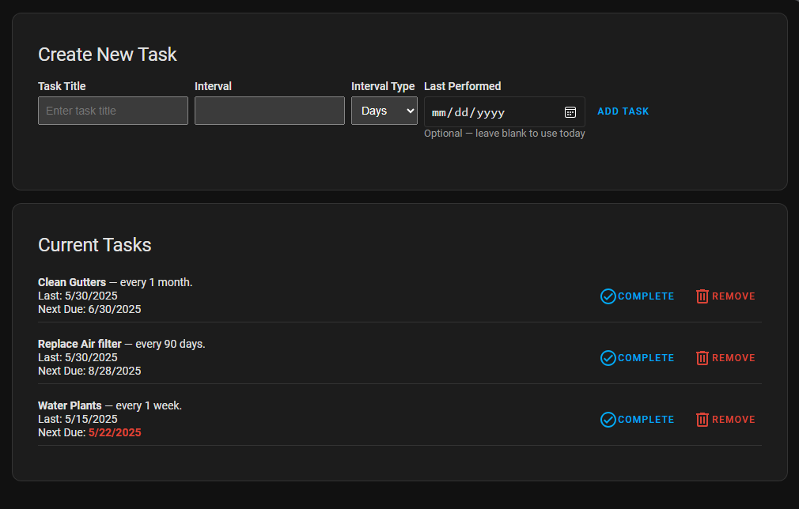
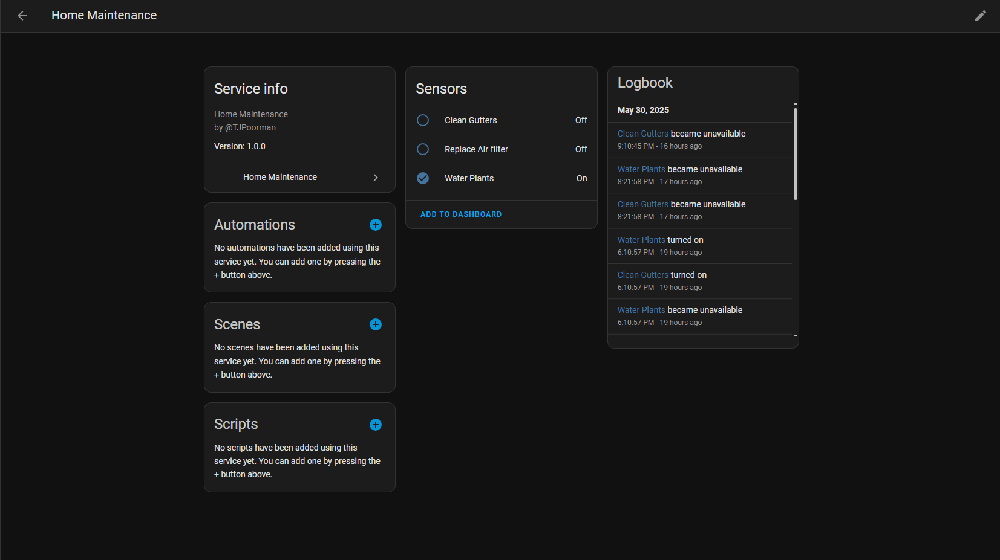
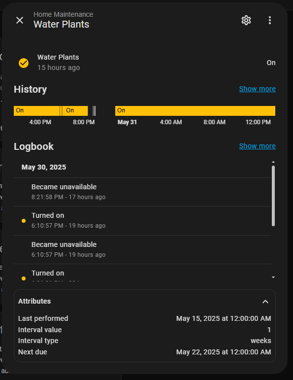

# 🏠 Home Maintenance Tracker for Home Assistant

Keep your home in top shape by tracking recurring maintenance tasks right inside Home Assistant!

This custom integration helps you remember important chores like changing air filters, cleaning gutters, or testing smoke alarms — and shows you when they're due.

---

## ✨ What It Does

- 📋 Lets you create recurring tasks (e.g., “Change HVAC filter every 90 days”)
- 🔔 Creates entities in Home Assistant to be able to create automations and display on dashboards
- ✅ Lets you mark tasks as completed so it can track the next due date
- 📊 Shows tasks in a clean, easy-to-use interface built into Home Assistant

---

## 🖼️ Screenshots

- 
- 
- 

---

## 🛠️ Installation

[](https://my.home-assistant.io/redirect/hacs_repository/?owner=TJPoorman&repository=home_maintenance&category=Integration)

<details>
<summary>Click to show installation instructions</summary>
<ol>
<li>Install files:</li>
<ul>
<li><u>Using HACS:</u><br>
In the HACS panel, search for 'Home Maintenance', open the repository and click 'Download'.</li>
<li><u>Manually:</u><br>
Download the <a href="https://github.com/TJPoorman/home_maintenance/releases">latest release</a> as a zip file and extract it into the `custom_components` folder in your HA installation.</li>
</ul>
<li>Restart HA to load the integration into HA.</li>
<li>Go to Settings -> Devices & services and click 'ADD INTEGRATION' button. Look for Home Maintenance and click to add it.</li>
<li>The Home Maintenance integration is ready for use. You can find the configuration panel in the menu on the left.</li>
</ol>
</details>

1. In Home Assistant, go to HACS.
1. Click the “⋮” (three dots menu) in the top-right corner, then choose “Custom repositories”.
1. In the dialog:
   1. Paste the URL of this repository (https://github.com/TJPoorman/home_maintenance)
   1. Set the category to Integration
   1. Click Add
1. After adding the custom repository, search for Home Maintenance in HACS and install it.
1. Restart Home Assistant.
1. Open Settings > Devices & Services > Integrations, click “+ Add Integration”, search for Home Maintenance, and follow the setup instructions.

---

## 🛠️ How to Use

- Open **Home Maintenance** from the Home Assistant sidebar.
- To add a new task enter:
  - A title (e.g., “Clean Dryer Vent”)
  - How often it needs to be done
  - Select the interval period (Defaults to days)
  - The last time you did it (Optional. If omitted will be today)
  - Click **Add Task**
- Tasks will show if they are due or overdue
- Click **Complete** to reset the Last Performed date to today

---

## 🔄 Example Tasks

| Task                 | Interval | Last Done     |
|----------------------|----------|---------------|
| Change HVAC Filter   | 90 days  | Jan 15, 2025  |
| Test Smoke Alarms    | 6 months | Dec 1, 2024   |
| Clean Gutters        | 8 weeks  | Oct 1, 2024   |

---

## 🔁 Available Services

### `home_maintenance.reset_last_performed`

Marks a specific task as completed and updates its `last_performed` and `next_due`.

#### Example service call:

```yaml
service: home_maintenance.reset_last_performed
data:
  entity_id: binary_sensor.clean_gutters
```

---

## 💬 Need Help?

Open an issue here on GitHub or ask in the Home Assistant community.

---

## 📄 License

MIT License – free to use, share, and improve.
